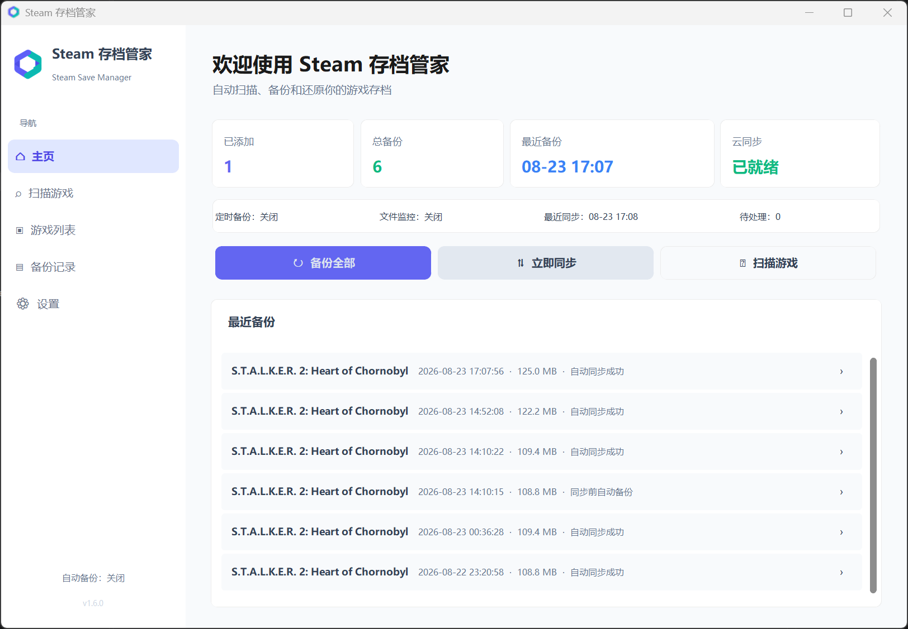
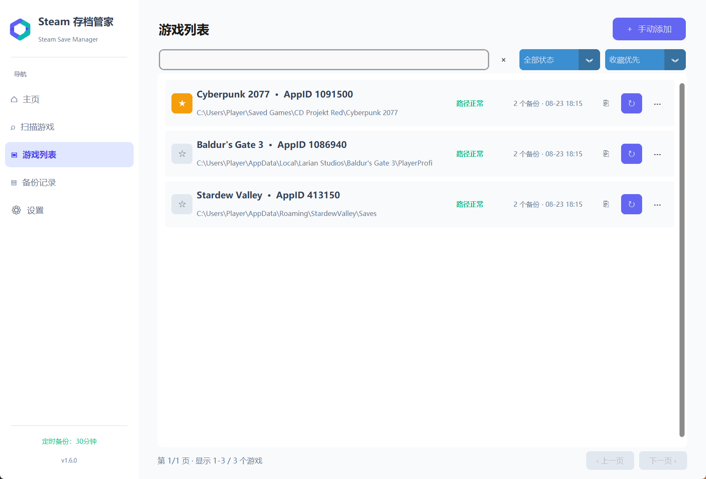
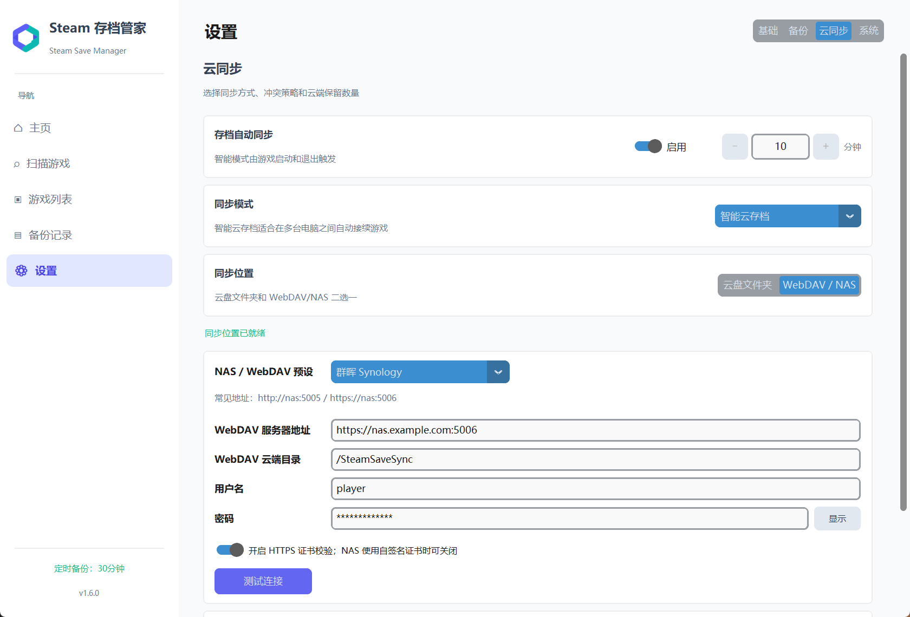

<p align="center">
  
</p>

<h1 align="center">Steam Save Manager</h1>

<p align="center">面向 Windows 的 Steam 游戏存档备份、恢复与多设备云同步工具。</p>

<p align="center">
  <a href="./README.md">中文</a> · <a href="./README_EN.md">English</a>
</p>

<p align="center">
  <a href="https://github.com/Kiowx/save_manager/actions/workflows/build.yml"></a>
  <a href="https://github.com/Kiowx/save_manager/releases/latest"></a>
  <a href="https://github.com/Kiowx/save_manager/releases"></a>
  <a href="./LICENSE"></a>
  <a href="https://www.python.org/"></a>
  
</p>

<p align="center">
  <a href="https://github.com/Kiowx/save_manager/releases/latest/download/SteamSaveManager.exe"><strong>下载最新 Windows EXE</strong></a>
  ·
  <a href="https://github.com/Kiowx/save_manager/releases">查看所有版本</a>
</p>



<details>
<summary>查看更多界面</summary>

### 游戏列表



### WebDAV / NAS 设置



</details>

## 功能特性

- 自动扫描 Steam 游戏并结合路径模板、`userdata` 和 Steam 元数据识别存档
- 显示扫描结果可信度，过滤危险目录，低可信结果默认不开启自动化
- 支持手动添加游戏、单个或多个存档文件、多存档路径和外部存档导入
- 支持手动备份、批量备份、定时备份、文件变动备份和游戏退出后备份
- 支持备份恢复、删除、完整性检查和按数量或总大小自动轮转
- 支持 OneDrive、Dropbox、Google Drive 等本地云盘文件夹
- 支持 WebDAV / NAS，内置 Synology、QNAP、TrueNAS、Nextcloud 和 OpenMediaVault 预设
- 支持智能云存档、双向同步、仅上传、仅下载、冲突处理和失败重试
- 全新安装或更换电脑时，可从 WebDAV 云端归档恢复游戏信息与最新存档
- 支持中英文界面、深浅色主题、高 DPI 自适应、列表筛选、排序、收藏和分页
- 支持系统托盘、开机自启、自动更新检查和下载文件 SHA-256 校验

## 快速开始

1. 下载 [SteamSaveManager.exe](https://github.com/Kiowx/save_manager/releases/latest/download/SteamSaveManager.exe)。
2. 将文件放到一个可写目录并直接运行。
3. 首次启动后检查 Steam 路径，然后扫描或手动添加游戏。
4. 在游戏详情中分别设置定时备份、文件监控、退出后备份和云同步。

Windows SmartScreen 可能会对未签名的新版本显示提示。请仅从本仓库的 [Releases](https://github.com/Kiowx/save_manager/releases) 页面下载。

## 自动备份行为

| 模式 | 触发方式 | 游戏运行时的行为 |
| --- | --- | --- |
| 定时自动备份 | 游戏运行且达到设定间隔 | 等待存档文件稳定后立即创建快照 |
| 文件变动备份 | 监控到存档文件变化 | 等待游戏退出，避免与活跃写入冲突 |
| 游戏退出后备份 | 检测到游戏进程退出 | 仅在对应游戏开关开启时执行 |

三种游戏级开关互相独立。关闭“游戏退出后自动备份”不会关闭定时自动备份。

## 云同步

### 同步位置

- **云盘文件夹**：选择 OneDrive、Dropbox、Google Drive 或其他桌面云盘的本地同步目录。
- **WebDAV / NAS**：配置服务器地址、云端目录和凭据，然后使用内置的连接测试检查创建、上传、下载和清理权限。

### 同步模式

| 模式 | 行为 |
| --- | --- |
| 智能云存档 | 游戏启动时下载，退出后上传，适合多台电脑接力游戏 |
| 双向同步 | 依据上次同步基线判断本地或云端的单边变化 |
| 仅上传 | 使用本地存档更新云端 |
| 仅下载 | 使用云端存档更新本地 |

当本地和云端都发生变化时，程序会保留冲突并要求用户选择，不会盲目覆盖。

## 数据保护

- 自动备份会等待文件元数据连续稳定，并在归档时校验源文件签名
- 暂时读取失败会自动重试，不会错误地进入冷却时间
- NAS 或网络备份会先在本地完成打包，再发布到目标位置
- 云端存档覆盖本地前会创建安全备份
- ZIP 备份会进行结构、CRC 和解压限制检查
- 编辑存档规则后，旧备份和云端同步包仍保留原有规则映射

## 从源码运行

### 环境

- Windows
- Python 3.10+

### 安装

```powershell
git clone https://github.com/Kiowx/save_manager.git
cd save_manager
python -m venv .venv
.\.venv\Scripts\Activate.ps1
python -m pip install -r requirements.txt
```

WebDAV 是可选功能，使用时另外安装：

```powershell
python -m pip install webdavclient3
```

### 运行

```powershell
python main.py
```

### 测试

```powershell
python -m unittest discover -s tests -v
```

### 打包

```powershell
pyinstaller --clean SteamSaveManager.spec
```

生成的可执行文件位于 `dist/SteamSaveManager.exe`。

## 数据位置

- `config.json`：应用目录可写时保存在应用目录，否则使用 `~/.steam_save_manager/config.json`
- `backups/`：默认位于应用目录，可在设置中自定义并迁移现有备份
- `webdav_sync_cache/`：位于配置目录，用于 WebDAV 云端归档缓存

## 项目结构

- [`main.py`](./main.py)：主程序与核心逻辑
- [`requirements.txt`](./requirements.txt)：基础运行和打包依赖
- [`SteamSaveManager.spec`](./SteamSaveManager.spec)：PyInstaller 打包配置
- [`assets/`](./assets)：Logo、Windows 图标和 README 截图
- [`tests/`](./tests)：备份、扫描安全和 UI 逻辑回归测试
- [`update/update.json`](./update/update.json)：客户端自动更新清单
- [`.github/workflows/build.yml`](./.github/workflows/build.yml)：Windows EXE 构建与 Release 发布流程

## 自动更新

客户端从以下地址读取更新清单：

```text
https://raw.githubusercontent.com/Kiowx/save_manager/refs/heads/main/update/update.json
```

更新清单包含版本、更新日志、下载地址和 SHA-256：

```json
{
  "version": "X.Y.Z",
  "notes": "更新日志",
  "url": "https://github.com/Kiowx/save_manager/releases/download/vX.Y.Z/SteamSaveManager.exe",
  "sha256": "可执行文件的 SHA-256"
}
```

发布流程会根据 `main.py` 中的版本号自动创建标签、Windows EXE、GitHub Release 和更新清单。

## 注意事项

- 自动识别结果仍建议在首次备份前手动确认
- 云盘客户端或 NAS 正在占用文件时，同步可能会暂时重试
- 恢复或切换云端版本前，建议保留至少一个已验证的本地备份
- 如果存档位置不确定，不要将整个游戏安装目录作为存档目录

## 问题反馈

请在 [GitHub Issues](https://github.com/Kiowx/save_manager/issues) 中提交问题，并附上软件版本、复现步骤和相关界面或错误信息。

## License

本项目使用 [MIT License](./LICENSE)。
