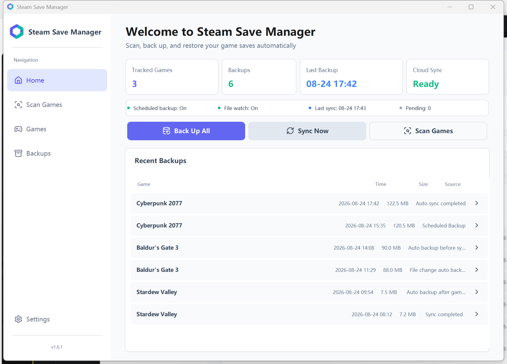

<p align="center">
  
</p>

<h1 align="center">Steam Save Manager</h1>

<p align="center">A Windows app for backing up, restoring, and syncing Steam game saves across PCs.</p>

<p align="center">
  <a href="./README.md">中文</a> · <a href="./README_EN.md">English</a>
</p>

<p align="center">
  <a href="https://github.com/Kiowx/save_manager/actions/workflows/build.yml"></a>
  <a href="https://github.com/Kiowx/save_manager/releases/latest"></a>
  <a href="https://github.com/Kiowx/save_manager/releases"></a>
  <a href="./LICENSE"></a>
  <a href="https://www.python.org/"></a>
  
</p>

<p align="center">
  <a href="https://github.com/Kiowx/save_manager/releases/latest/download/SteamSaveManager.exe"><strong>Download the latest Windows EXE</strong></a>
  ·
  <a href="https://github.com/Kiowx/save_manager/releases">View all releases</a>
</p>



## Features

- Scans Steam games and combines path templates, `userdata`, and Steam metadata to locate saves
- Shows detection confidence, rejects unsafe locations, and keeps automation off for low-confidence results
- Supports manually added games, individual save files, multiple files and paths, and importing external saves
- Creates manual, batch, scheduled, file-change, and game-exit backups
- Restores, deletes, and verifies backups, with retention limits by count or total size
- Syncs through local OneDrive, Dropbox, Google Drive, or other desktop cloud folders
- Supports WebDAV and NAS servers with presets for Synology, QNAP, TrueNAS, Nextcloud, and OpenMediaVault
- Provides Smart Cloud Save, bidirectional, upload-only, and download-only modes with conflict handling and retries
- Rebuilds game entries and retrieves the latest saves from WebDAV archives after a fresh install or PC change
- Includes Chinese and English UI, light and dark themes, and responsive layouts for high-DPI and compact windows
- Uses consistent flat icons, clear empty states, and action feedback, with filtering, sorting, favorites, pagination, tooltips, and scrollbars shown only when needed
- Supports the system tray, launch at sign-in, update checks, and SHA-256 verification of downloaded updates

## Quick Start

1. Download [SteamSaveManager.exe](https://github.com/Kiowx/save_manager/releases/latest/download/SteamSaveManager.exe).
2. Place it in a writable folder and run it directly.
3. Confirm the Steam path, then scan for games or add one manually.
4. Configure scheduled backup, file monitoring, backup on exit, and cloud sync independently for each game.

Windows SmartScreen may warn about a newly published unsigned build. Only download the executable from this repository's [Releases](https://github.com/Kiowx/save_manager/releases) page.

## Automatic Backup Behavior

| Mode | Trigger | Behavior while the game is running |
| --- | --- | --- |
| Scheduled backup | The game is running and the configured interval is reached | Waits for stable save metadata, then creates a snapshot immediately |
| File-change backup | A monitored save file changes | Waits for game exit to avoid active-write conflicts |
| Backup after game exit | The game process exits | Runs only when the per-game option is enabled |

These three per-game options are independent. Disabling **Back up after game exit** does not disable scheduled backups.

## Cloud Sync

### Storage Backends

- **Cloud folder:** Choose a local folder managed by OneDrive, Dropbox, Google Drive, or another desktop cloud client.
- **WebDAV / NAS:** Configure the server URL, cloud path, and credentials, then use the built-in connection test to check create, upload, download, and cleanup permissions.

### Sync Modes

| Mode | Behavior |
| --- | --- |
| Smart Cloud Save | Downloads on game launch and uploads after game exit; intended for continuing a game across multiple PCs |
| Bidirectional | Uses the previous sync baseline to determine whether the local or cloud copy changed |
| Upload Only | Updates the cloud copy from the local save |
| Download Only | Updates the local save from the cloud copy |

If both the local and cloud copies changed, the app records a conflict and asks which side to keep instead of overwriting either copy blindly.

## Data Protection

- Automatic backups require consecutive stable metadata samples and verify the source signature while archiving
- Temporary read failures are retried without incorrectly advancing the cooldown
- NAS and network backups are packaged locally before being published to the destination
- A safety backup is created before a cloud save overwrites the local copy
- ZIP backups are checked for structure, CRC errors, and extraction limits
- Existing backups and cloud archives retain their original rule mappings after save rules are edited

## Run from Source

### Requirements

- Windows
- Python 3.10+

### Install

```powershell
git clone https://github.com/Kiowx/save_manager.git
cd save_manager
python -m venv .venv
.\.venv\Scripts\Activate.ps1
python -m pip install -r requirements.txt
```

WebDAV is optional. Install its dependency when needed:

```powershell
python -m pip install webdavclient3
```

### Run

```powershell
python main.py
```

### Test

```powershell
python -m unittest discover -s tests -v
```

### Build

```powershell
pyinstaller --clean SteamSaveManager.spec
```

The packaged executable is written to `dist/SteamSaveManager.exe`.

## Data Locations

- `config.json`: stored beside the app when that directory is writable; otherwise stored at `~/.steam_save_manager/config.json`
- `backups/`: stored beside the app by default; the location can be changed in Settings, with migration offered for existing backups
- `webdav_sync_cache/`: stored in the configuration directory and used to cache WebDAV cloud archives

## Project Structure

- [`main.py`](./main.py): application entry point and core logic
- [`requirements.txt`](./requirements.txt): base runtime and packaging dependencies
- [`SteamSaveManager.spec`](./SteamSaveManager.spec): PyInstaller build configuration
- [`assets/`](./assets): logo, Windows icon, interface icons, and README screenshots
- [`tests/`](./tests): backup, scan-safety, and UI-logic regression tests
- [`update/update.json`](./update/update.json): client update manifest
- [`.github/workflows/build.yml`](./.github/workflows/build.yml): Windows EXE build and GitHub Release workflow

## Automatic Updates

The client reads its update manifest from:

```text
https://raw.githubusercontent.com/Kiowx/save_manager/refs/heads/main/update/update.json
```

The manifest contains the version, release notes, download URL, and SHA-256 digest:

```json
{
  "version": "X.Y.Z",
  "notes": "Release notes",
  "url": "https://github.com/Kiowx/save_manager/releases/download/vX.Y.Z/SteamSaveManager.exe",
  "sha256": "SHA-256 of the executable"
}
```

The release workflow reads the version from `main.py` and automatically creates the tag, Windows executable, GitHub Release, and update manifest.

## Notes

- Verify automatically detected paths before creating the first backup
- Sync may retry temporarily while a desktop cloud client or NAS is locking files
- Keep at least one verified local backup before restoring or switching cloud versions
- Do not select an entire game installation folder when the actual save location is unknown

## Feedback

Open a [GitHub Issue](https://github.com/Kiowx/save_manager/issues) with the app version, reproduction steps, and any relevant UI or error details.

## License

This project is licensed under the [MIT License](./LICENSE).
